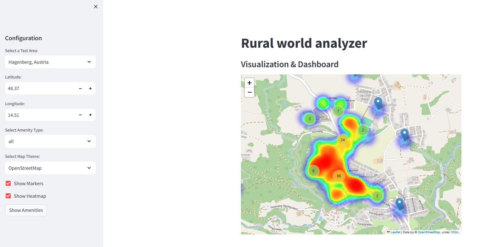

# Rural World Analyzer

Rural World Analyzer is an interactive Streamlit application that allows users to explore and visualize amenities in rural areas using OpenStreetMap data. The app fetches geographic data through OSMnx and presents it in dynamic maps with markers and heatmaps, as well as interactive charts using Plotly.



## Features

- **Interactive Map Visualization:** 
  - Display amenities using markers with tooltips.
  - Overlay a heatmap layer for density visualization.
  - Customize map themes (e.g., OpenStreetMap, Stamen Terrain, CartoDB Positron).

- **Dynamic Data Retrieval:** 
  - Fetch amenities based on user-specified coordinates and radius.
  - Filter results by amenity types (e.g., restaurant, hospital, school).

- **Data Dashboard:**
  - Visualize the distribution of amenities with interactive Plotly bar charts.

- **Easy Configuration:** 
  - Sidebar controls to configure the test area, coordinates, amenity type, and visualization options.


## Code Structure

- **Constants & Example Data:**  
  Contains default configurations such as radius, example coordinates, and map theme options.

- **Helper Functions:**  
  - `compute_zoom_level`: Dynamically calculates the map zoom level based on the radius.
  - `get_amenities`: Fetches amenities data using OSMnx.
  - `add_markers_to_map`: Adds markers to the Folium map.
  - `add_heatmap_to_map`: Adds a heatmap layer to the Folium map.
  - `create_plotly_chart`: Generates a bar chart for amenity distribution.

- **Main Application:**  
  Contains the Streamlit app logic that integrates the sidebar configuration and data visualizations.

## Customization

Feel free to modify the code to better suit your needs:
- **Radius & Test Areas:** Update the `RADIUS_DEFAULT` and `example_coordinates` as needed.
- **Amenity Types:** Customize or extend the list of amenity types in the sidebar.
- **Map Themes:** Add or change map themes by updating the `map_themes` dictionary.

## Reference

For further reading, refer to our recent publications:

```
@article{martinez2025overview,
  title={An overview of civic engagement tools for rural communities},
  author={Martinez-Gil, Jorge and Pichler, Mario and Lechat, Noemi and Lentini, Gianluca and Cvar, Nina and Trilar, Jure and Bucchiarone, Antonio and Marconi, Annapaola},
  journal={Open Research Europe},
  volume={4},
  number={195},
  pages={195},
  year={2025},
  publisher={F1000 Research Limited}
}
```

## License

This project is licensed under the [MIT License](LICENSE).
