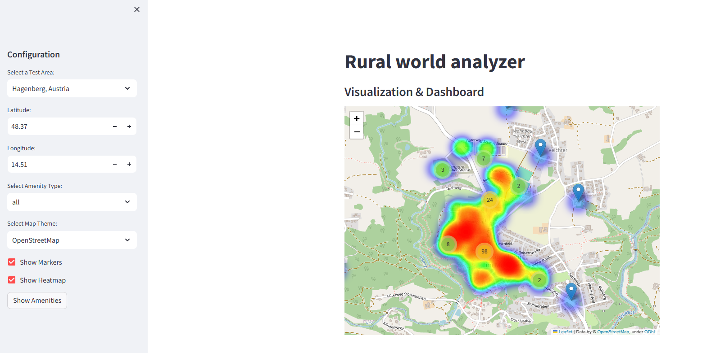

# 🌿 Rural World Analyzer

[](https://rural-world-analyzer.streamlit.app/)
[](LICENSE)
[](https://www.python.org/)
[](https://osmnx.readthedocs.io/)

> **An open-source geospatial tool for quantifying and visualizing civic amenity distribution in rural and semi-urban areas.**

Rural World Analyzer enables researchers, planners, and policymakers to interactively explore the availability and diversity of public services in rural territories using OpenStreetMap data. It introduces the **Rural Accessibility Index (RAI)**, a composite metric for comparing service provision across geographic areas.

## 📖 Table of Contents

- [🌐 Live Demo](#-live-demo)
- [🧐 Why This Matters](#-why-this-matters)
- [📸 Screenshots](#-screenshots)
- [✨ Features](#-features)
- [🚀 Quick Start](#-quick-start)
- [🧮 Methodology](#-methodology)
- [🔧 Configuration](#-configuration--customization)
- [📦 Repository Structure](#-repository-structure)
- [🤝 Contributing](#-contributing)
- [📄 Citation](#-citation)
- [📜 License](#-license)

## 🌐 Live Demo

👉 **[https://rural-world-analyzer.streamlit.app/](https://rural-world-analyzer.streamlit.app/)**

## 🧐 Why This Matters

Rural communities often face significant challenges in accessing essential services like healthcare, education, and finance. Conventional GIS analysis can be cost-prohibitive or technically demanding for local planners.

**Rural World Analyzer** bridges this gap by offering:
- **Instant Insights:** Get immediate feedback on the service density of any location worldwide.
- **Diversity Metrics:** Go beyond simple counts with Shannon entropy and the RAI.
- **Side-by-Side Comparison:** Evaluate how different regions compare in terms of amenity provision.

## 📸 Screenshots

| Standard Analysis | Comparison Mode |
| :---: | :---: |
|  | *[Comparison mode allows side-by-side analysis]* |

## ✨ Features

- 🗺️ **Interactive Map Visualization** — markers, heatmaps, and radius overlays via Folium
- 📊 **Amenity Distribution Charts** — Plotly-powered bar charts of amenity type frequencies
- 🧮 **Rural Accessibility Index (RAI)** — novel composite metric (0–100) combining amenity count, diversity, and Shannon entropy
- 🔬 **Shannon Diversity Index** — ecological diversity measure applied to urban service landscapes
- 🔄 **Area Comparison Mode** — side-by-side analysis of two geographic areas
- 📥 **Data Export** — download results as CSV or GeoJSON for reproducible research
- 🌍 **Global Coverage** — pre-loaded example locations across Europe, Americas, Africa, and Asia
- 🎨 **Multiple Map Themes** — OpenStreetMap, CartoDB Positron, CartoDB Dark Matter, and more

## 🚀 Quick Start

### Run locally

1. **Clone the repository**
   ```bash
   git clone https://github.com/jorge-martinez-gil/rural-world-analyzer.git
   cd rural-world-analyzer
   ```

2. **Set up a virtual environment (recommended)**
   ```bash
   python -m venv venv
   # On Windows
   .\venv\Scripts\activate
   # On macOS/Linux
   source venv/bin/activate
   ```

3. **Install dependencies**
   ```bash
   pip install -r requirements.txt
   ```

4. **Launch the application**
   ```bash
   streamlit run app.py
   ```

### Run with Docker (optional)
```bash
docker run -p 8501:8501 -v $(pwd):/app streamlit/streamlit:latest streamlit run /app/app.py
```

## 🧮 Methodology

### Rural Accessibility Index (RAI)
The RAI is a composite score (0–100) defined as:

```
RAI = min(100, N * 0.4 + H * 30 + K * 2)
```

Where:
- **N** = total number of amenities within the search radius
- **H** = Shannon diversity index of amenity types: H = -Σ(p_i * log(p_i))
- **K** = number of unique amenity categories

This formulation rewards both quantity and variety of services, penalizing areas with many amenities of a single type.

## 📦 Repository Structure

```
rural-world-analyzer/
├── app.py              # Main Streamlit application
├── requirements.txt    # Python dependencies
├── CITATION.cff        # Machine-readable citation file
├── .zenodo.json        # Zenodo metadata for DOI minting
├── paper.md            # JOSS-style research paper
├── CONTRIBUTING.md     # Contribution guidelines
├── LICENSE             # MIT License
└── README.md           # This file
```

## 🔧 Configuration & Customization

| Parameter | Default | Description |
| :--- | :--- | :--- |
| **Radius** | 1000 m | Search radius around the target point (300m - 3000m) |
| **Amenity Type** | all | Filter by specific OSM amenity tag (restaurant, hospital, etc.) |
| **Map Theme** | OpenStreetMap | Base tile layer (Positron, Dark Matter, Satellite, etc.) |
| **Comparison Mode** | Off | Enable side-by-side area comparison |

## 🤝 Contributing

Contributions are welcome! Please read [CONTRIBUTING.md](CONTRIBUTING.md) for guidelines on how to submit pull requests, report issues, or suggest new features.

## 📄 Citation

If you use Rural World Analyzer in your research, please cite:

```bibtex
@article{martinez2025overview,
  title={An overview of civic engagement tools for rural communities},
  author={Martinez-Gil, Jorge and Pichler, Mario and Lechat, Noemi and Lentini, Gianluca and Cvar, Nina and Trilar, Jure and Bucchiarone, Antonio and Marconi, Annapaola},
  journal={Open Research Europe},
  volume={4},
  number={195},
  pages={195},
  year={2025},
  publisher={F1000 Research Limited}
}
```

You can also cite the software directly using the metadata in [CITATION.cff](CITATION.cff).

## 🙏 Acknowledgements

This tool was developed in the context of rural digitalization and smart village research. It relies on [OSMnx](https://github.com/gboeing/osmnx) by Geoff Boeing and the broader OpenStreetMap community.

## 📜 License

This project is licensed under the [MIT License](LICENSE).
